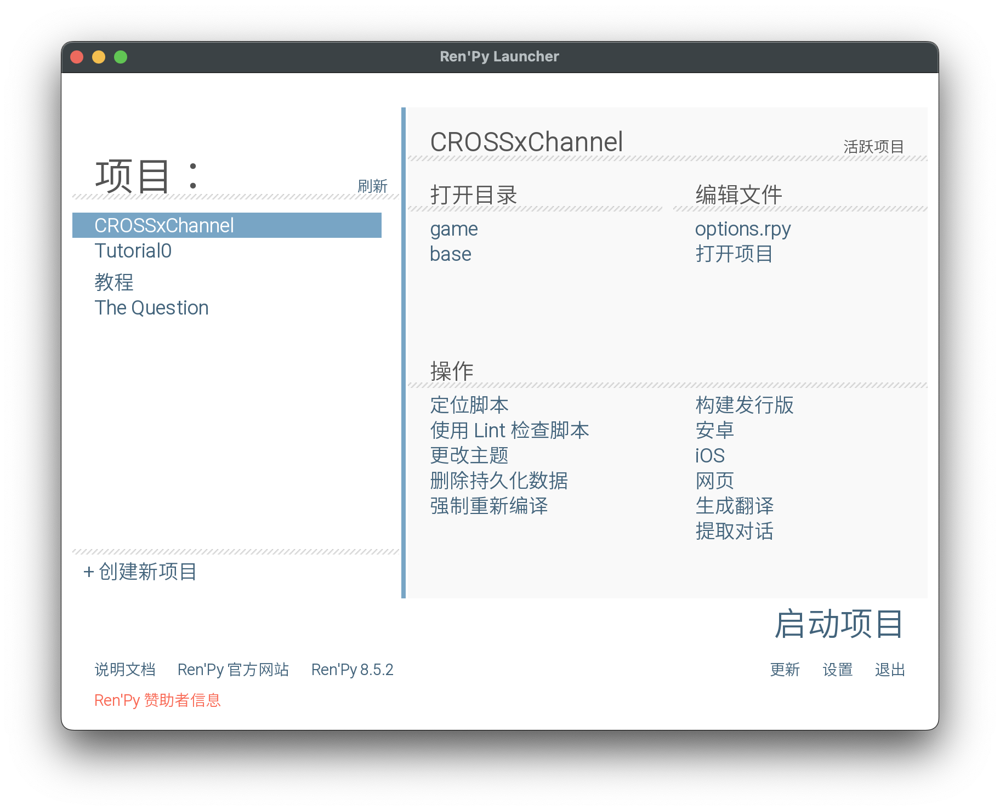
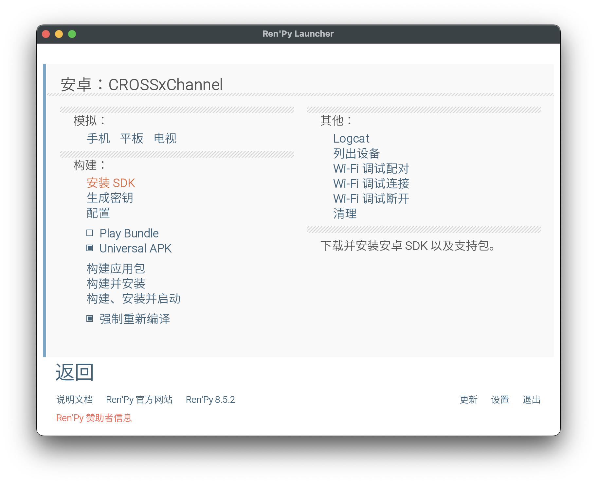
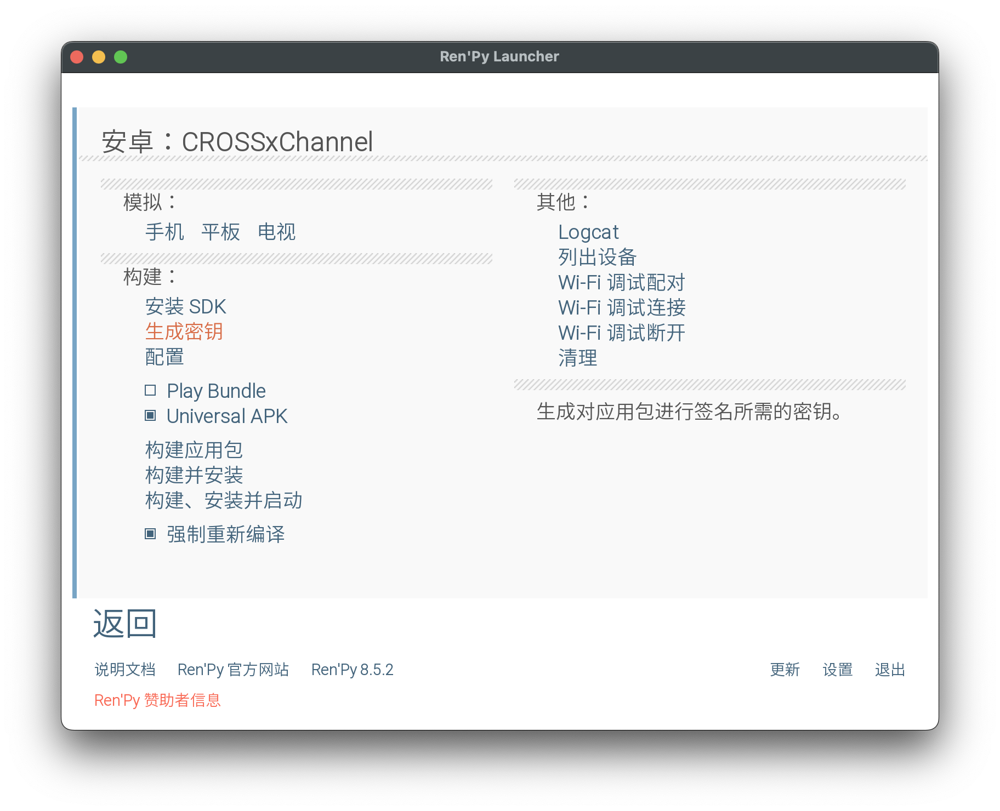
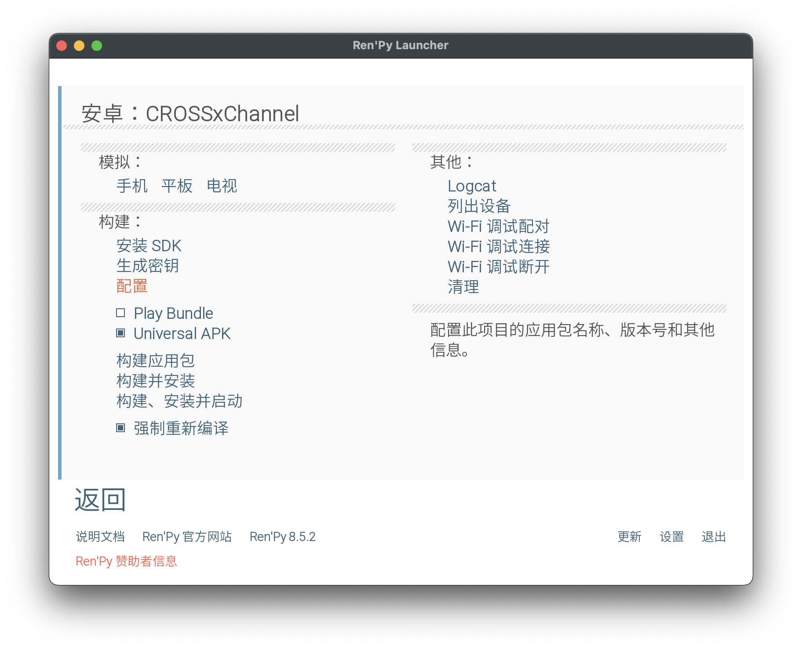
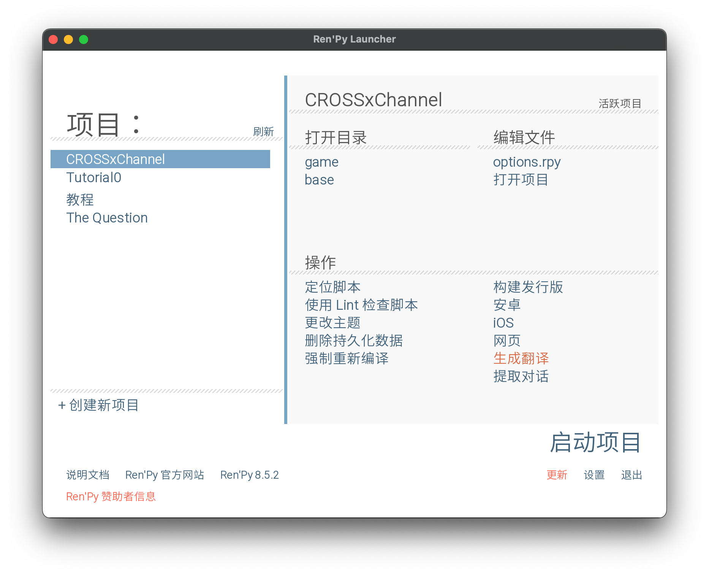
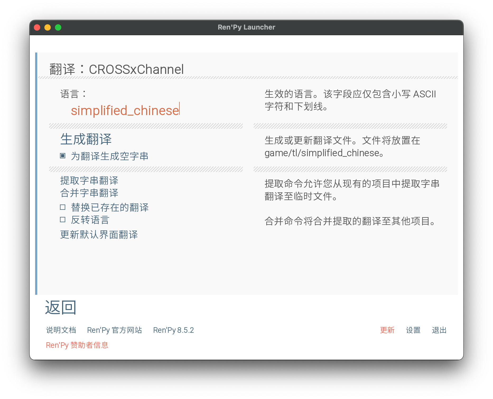

# 全平台移植版本

感谢fk1995提供，该版本基于`Ren'Py`引擎，欢迎大家提交pull requests 以及修复BUG！

## 文件目录结构（如果有兴趣，欢迎用本repo下的所有工具进行尝试）


# CROSS✝CHANNEL Android 端编译环境

因为之前的 Android 安装包支持版本老旧，需要用比较麻烦的方法才能运行，所以有了这个构建文档，它借助 renpy 跨平台的优势，通过桌面版程序资源和脚本，重新打包为支持 Android 最新系统的直装 APK，能够很方便的安装和游玩。

## 阅前提示

最终打包使用的 renpy 工程参见 [Intro1997/cross-channel_chinese-localization_project/Release](https://github.com/Intro1997/cross-channel_chinese-localization_project/releases) 下的 `CROSSxChannel.zip`，

本方案虽然没有进行任何资源相关的改动，但未经完整测试，如果在构建、安装以及游玩时遇到任何问题，请在本 repo 中提交 issue，并 [@Intro1997](https://github.com/Intro1997) 协助，感谢您的支持和理解！

### 已修复的问题

1. 修复：带有语音播放的对话因为 hash 值错位导致无法显示汉化内容。

## 准备工作

1. 安装 [Ren'Py](https://www.renpy.org/)
2. 安装 [adb](https://developer.android.com/tools/adb?hl=zh-cn)
3. 科学上网
4. 去汉化组搭建的[官网](https://www.crosschannel.games/)下载 [crosschannel-1.0-windows.linux.mac.zip](https://github.com/MewX/cross-channel_chinese-localization_project/releases/download/moved.v1.01.basedon.v0.99/crosschannel-1.0-windows.linux.mac.zip)，因为要访问 github，所以请准备对应工具，或者访问各种镜像网站也可以（不知道 Release 页面的 crosschannel-2.01-windows.linux.mac.zip 是否也可以，我这边只尝试了 1.0）。
5. 确保能够找到编译 apk 需要的资源：
   若 renpy 找不到 java home，并且你已经安装了 Android studio，请添加对应路径，以 `macOS` 为例，在 `~/.zshrc` 中，添加:

```bash
export JAVA_HOME="/Applications/Android Studio.app/Contents/jbr/Contents/Home"
```

并且通过 `./renpy.sh` 启动，直接打开应用会提示找不到 java，猜测可能是因为直接开启应用后，终端环境不同导致的。

## 配置 Ren'Py Android 环境

Ren'Py 提供了比较方便的 Android 环境配置方法，随便选择一个项目，依次点击，安卓->安装 SDK->生成密钥->配置 就好：









如果遇到网络错误，请自行搜索解决，这个问题不在本文讨论范围内。

## 补充资源文件

我们下载好游戏文件后，进行解压，这里假设解压后的文件目录为 `CrossChannel`。解压完成后，找到 `CrossChannel/game/archive.rpa` 这个文件，我们需要通过 unrpa 工具解压它。
我们将文件解压到 `CrossChannel/resources` 文件夹内备用。

```
# -p [解压文件存放地址] [解压文件目录]
$ cd CrossChannel
$ mkdir resources
$ cd resources
$ unrpa -p . ../game/archive.rpa
```

1. 补充游戏图标

   我们解压出来的资源文件中，`CrossChannel/resources/icon.png` 为游戏图标，由于 Android 系统对应用图标的处理，这里建议使用 `512x512` 的图标。并进行留边处理，可参考代码:

```python
from PIL import Image

def fix_icon_safe_zone(input_path, output_path):
    # 目标大小
    canvas_size = 512
    # 安全区大小（大约 66%-70%）
    # 512 * 0.66 ≈ 338
    safe_size = 340

    with Image.open(input_path) as img:
        img = img.convert('RGBA')
        # 1. 先把原图缩放到安全区大小
        img.thumbnail((safe_size, safe_size), Image.Resampling.LANCZOS)

        # 2. 创建一个透明的 512x512 背景
        new_img = Image.new('RGBA', (canvas_size, canvas_size), (0, 0, 0, 0))

        # 3. 将原图居中贴上去
        offset = ((canvas_size - img.size[0]) // 2, (canvas_size - img.size[1]) // 2)
        new_img.paste(img, offset, img)

        new_img.save(output_path)
        print("已完成：图标已缩放至安全区并居中。")

fix_icon_safe_zone("your_source_icon.png", "icon.png")
```

我们将 icon.png 通过上述代码处理成以下两个文件：
`./android-icon_background.png`
`./android-icon_foreground.png`
放在 CrossChannel 目录。这里直接贴出处理好的图标，两个文件都是同一个资源：


2. 补充游戏加载背景图片
   这里我忘记了图片来源，倒是可以使用任何图片作为加载时的背景图片。我使用的是这个，`archive.rpa` 资源包里可能应该有，但是我没有找到。这里将加载图片保存为 `android-presplash.png` 存储在 CrossChannel 目录。我这里也贴出我使用的资源：


3. 将 archive.rpa 内解压的所有文件，也就是 `CrossChannel/resources` 下的所有文件复制到 `CrossChannel/game` 文件夹下，包括 `icon.png`，若没有该文件，则无法运行 apk（Android studio debug 的时候会不断提示缺少 icon.png 这或许是源代码内的资源校验逻辑）。
   然后删除 archive.rpa 和 `CrossChannel/resources` 文件夹

4. 重替换汉化脚本
   因未知原因导致重新构建后，会出现带有脚本内语音播放的对话 hash 值与真实值不一致的问题
   例如

```rpy
translate simplified_chinese cca0002_fc8c6ddc:

    # voice "vmcca0002sku000"
    # 桜庭 "『このＮＥＷチャリで峠を制覇してみせる。これって、今の俺には必要なことだと思うから』"
    voice "vmcca0002sku000"
    樱庭 "‘用这台ＮＥＷ自行车称霸山顶。现在这个目标对我万分重要。’"
```

这里的 cca0002_fc8c6ddc 不正确。这个问题不建议自行解决，比较麻烦，可以直接使用 [Intro1997/cross-channel_chinese-localization_project/Release](https://github.com/Intro1997/cross-channel_chinese-localization_project/releases) 编译 android 版本。如果你感兴趣，下面是解决这个问题的方法：

注意：进行该操作之前，需要备份 tl 文件夹（用于后续填充翻译），接着可以直接删除 tl 文件夹；否则 renpy 遇到已经存在的文件时，只会增量更新，若原先存在的翻译对应的 hash 不正确，不会更新该 hash，因为该翻译已经完成，且被需要。

该 hash 值由 renpy 引擎生成，通过



生成翻译，语言名称为生成的翻译框架脚本文件存储位置，如 simplified_chinese，则文件存在于 `game/tl/simplified_chinese`



生成翻译框架脚本后，我写了个 py 脚本，用来 copy 框架脚本内正确的 hash 值到之前备份的 tl 翻译脚本文件中，感兴趣可以参考[script_hash_fixer](./tools/script_hash_fixer.py)。

替换完成后，将 `tl` 拷贝进 game 目录下即可

## 构建

找到你的 renpy 存放项目的目录，将 CrossChannel 文件夹整个拖进去，然后启动 renpy（如果是 macOS，建议通过 `renpy.sh` 启动）。
启动之后，你应该能够看到 CrossChannel 项目名称，在右侧操作栏中点击安卓，生成密钥，使用默认的就可以。然后点击配置，生成 `android.json`

如果你在构建项目时，使用了 renpy 给出的默认名称，后续想要修改，可以参考下面的代码来修改 android.json 文件:

```json
{
  "expansion": false,
  "google_play_key": null,
  "google_play_salt": null,
  "heap_size": "3",
  "icon_name": "CROSS\u271dCHANNEL",
  "include_pil": false,
  "include_sqlite": false,
  "layout": null,
  "name": "CROSS\u271dCHANNEL",
  "numeric_version": 1,
  "orientation": "sensorLandscape",
  "package": "com.crosschannel.program",
  "permissions": ["VIBRATE", "INTERNET"],
  "source": false,
  "store": "none",
  "update_always": true,
  "update_icons": true,
  "update_keystores": true,
  "version": "1.0"
}
```

最后，点击左侧的构建应用包，完成后 renpy 会自动打开生成的目录位置。

## 游戏内操作方式

除了基本的点击之外，游戏还有滑动的操作方式：

1. 剧情过程中上滑进入存档界面，再次上滑返回游戏
2. 剧情过程中下滑进入日志界面，上滑返回游戏界面
3. 右滑进入 auto 模式
